# 📜 Understanding Change Management

This document explains the process of **Change Management**. The goal is to make changes to a system (like deploying new code or updating infrastructure) in a planned and controlled way to minimize risk and prevent incidents.

---

## The Change Management Lifecycle

This diagram shows the typical workflow for a planned change.

```mermaid
flowchart TD
    %% --- Style Definitions ---
    classDef plan fill:#e3f2fd,stroke:#0d47a1
    classDef review fill:#fff9c4,stroke:#fbc02d
    classDef implement fill:#e8f5e9,stroke:#2e7d32
    classDef verify fill:#fce4ec,stroke:#ad1457
    classDef final fill:#dcedc8,stroke:#558b2f

    %% --- Components ---
    A("📝 Plan the Change")
    B("🤔 Review & Approve")
    C("⚙️ Implement")
    D("✅ Verify & Monitor")
    E("🎉 Success")
    F("⏪ Rollback")

    %% --- Connections ---
    A -- "Create Change Request" --> B
    B -- "Approved" --> C
    B -- "Rejected" --> A
    C -- "Change is deployed" --> D
    D -- "Everything looks good" --> E
    D -- "Something is wrong!" --> F
    F -- "Execute Rollback Plan" --> A

    %% --- Apply Styles ---
    class A plan;
    class B review;
    class C implement;
    class D verify;
    class E,F final;
```

### How to Explain This Diagram:

1.  **Plan the Change**: Before you do anything, you must document what you want to change, why you're changing it, what the risks are, and—most importantly—a **rollback plan** in case things go wrong.

2.  **Review & Approve**: The plan is reviewed by other team members or a Change Advisory Board (CAB). They look for risks and potential impact. The change must be approved before it can be implemented. This prevents engineers from making risky changes without oversight.

3.  **Implement**: The change is executed. This is often done during a "maintenance window" when traffic is low to reduce the impact of any potential issues.

4.  **Verify & Monitor**: After the change is live, the team closely monitors system dashboards (CPU, memory, error rates, etc.) to confirm that everything is working as expected.

5.  **Success or Rollback**:
    *   If the system is healthy after the change, the process is a **Success** and the change is complete.
    *   If monitoring shows a problem (e.g., error rates are spiking), the team immediately executes the **Rollback** plan to revert the system to its last known good state. The process then starts over from the planning phase to fix the issue.