# 🐳 Docker Hub Workflow: Push & Pull

This diagram explains the end-to-end process of building a Docker image locally, pushing it to Docker Hub, and pulling it to a server to run as a container.

```mermaid
flowchart TB
    %%{init: { "theme": "default", "flowchart": { "rankSpacing": 100 } } }%%
    %% --- Style Definitions ---
    classDef devStyle fill:#cde4ff,stroke:#1565c0,stroke-width:2px,color:#333
    classDef hubStyle fill:#fce4ec,stroke:#ad1457,stroke-width:2px,color:#333
    classDef prodStyle fill:#d4edda,stroke:#2e7d32,stroke-width:2px,color:#333

    %% --- Developer's Machine ---
    subgraph DevPC[Developer's Machine]
        direction TB
        Code["</> Source Code<br>📄 Dockerfile"]
        Build["1. `docker build`<br>Builds image from Dockerfile"]
        Tag["2. `docker tag`<br>Tags image as `user/repo:tag`"]
        Login["3. `docker login`<br>Authenticates with Docker Hub"]
        Push["4. `docker push`<br>Uploads the tagged image"]
    end

    %% --- Docker Hub ---
    subgraph DockerHub[☁️ Docker Hub Registry]
        Repo["Image Repository</br>stores `user/repo:tag`"]
        Repo["Image Repository<br>stores `user/repo:tag`"]
    end

    %% --- Production Server ---
    subgraph ProdServer[Production Server / K8s Cluster]
        direction TB
        Pull["5. `docker pull`<br>Pulls image from Docker Hub"]
        Run["6. `docker run` or `kubectl apply`<br>Starts the container from the image"]
        Container["🚀 Running Container"]
    end

    %% --- Connections ---
    Code --> Build --> Tag --> Login --> Push
    Push -- "Uploads Image" --> Repo
    Repo -- "Downloads Image" --> Pull
    Pull --> Run --> Container

    %% --- Apply Styles ---
    class Code,Build,Tag,Login,Push devStyle
    class Repo hubStyle
    class Pull,Run,Container prodStyle
```

