# 🐳 Docker Architecture vs. Kubernetes

This guide explains the simple, single-host architecture of Docker and compares it to the multi-host orchestration provided by Kubernetes.

## Docker Architecture (Single Host)

This diagram shows the core components of Docker running on a single machine.

```mermaid
flowchart TB
    %% --- Style Definitions ---
    classDef clientStyle fill:#cde4ff,stroke:#1565c0,stroke-width:2px,color:#333
    classDef hostStyle fill:#d4edda,stroke:#2e7d32,stroke-width:2px,color:#333
    classDef registryStyle fill:#fef2c0,stroke:#ef6c00,stroke-width:2px,color:#333

    %% --- Components ---
    Client("💻 Docker Client (CLI)")
    
    subgraph DockerHost["🖥️ Docker Host (Your PC or a Server)"]
        Daemon["⚙️ Docker Daemon (dockerd)"]
        Images["📚 Images</br>(Read-only Templates)"]
        Containers["🚀 Containers</br>(Running Instances)"]
    end

    Registry["☁️ Docker Registry</br>(e.g., Docker Hub)"]

    %% --- Connections ---
    Client -- "docker build, run, pull" --> Daemon
    Daemon -- "Pulls" --> Registry
    Daemon -- "Builds image from Dockerfile" --> Images
    Images -- "Used to create" --> Containers
    Daemon -- "Runs" --> Containers

    %% --- Apply Styles ---
    class Client clientStyle
    class Daemon,Images,Containers hostStyle
    class Registry registryStyle
```

---

## 🆚 How is this different from Kubernetes?

This diagram is a great way to show the core difference between Docker and Kubernetes.

*   **Docker (as shown above) manages containers on a *single machine* (a single Docker Host).** It's perfect for developing and running one application on one server.

*   **Kubernetes (like in your `k8s.md` diagram) manages containers across *many machines* (a cluster of Worker Nodes).** It's an **orchestrator**.

Think of it like this:
*   **Docker** is a single, talented musician playing all the instruments for a song by themself.
*   **Kubernetes** is the **orchestra conductor**, telling many different musicians (the worker nodes and their container runtimes) what to play and when, ensuring they all work together perfectly to perform a symphony.

*   **Orchestration** Container Orchestration (e.g., Kubernetes): Manages the deployment, scaling, networking, and availability of containerized applications.