# 💾 Backing Up etcd in Kubernetes

This diagram explains the process of creating a snapshot of the `etcd` database, which is the brain of your Kubernetes cluster, and storing it in a safe, external location.

```mermaid
flowchart TB
    %% --- Style Definitions ---
    classDef userStyle fill:#e0f7fa,stroke:#00796b,stroke-width:2px,color:#333
    classDef nodeStyle fill:#d4edda,stroke:#2e7d32,stroke-width:2px,color:#333
    classDef etcdStyle fill:#f8d7da,stroke:#721c24,stroke-width:2px,color:#333
    classDef storageStyle fill:#fff3e0,stroke:#ef6c00,stroke-width:2px,color:#333

    %% --- Components ---
    Admin("👨‍💻 Admin")

    subgraph ControlPlaneNode["🖥️ Control Plane Node"]
        direction TB
        EtcdPod["📦 etcd Pod"]
        Etcdctl["`etcdctl snapshot save ...`"]
        SnapshotFile["📄 snapshot.db"]
    end

    SecureLocation["☁️ Secure Off-site Storage<br>(e.g., S3 Bucket)"]

    %% --- Connections ---
    Admin -- "1. SSH into node" --> ControlPlaneNode
    Admin -- "2. Runs command" --> Etcdctl
    Etcdctl -- "3. Connects to" --> EtcdPod
    Etcdctl -- "4. Creates" --> SnapshotFile
    Admin -- "5. Securely copies (scp/s3 cp)" --> SecureLocation

    %% --- Apply Styles ---
    class Admin userStyle
    class ControlPlaneNode,Etcdctl nodeStyle
    class EtcdPod,SnapshotFile etcdStyle
    class SecureLocation storageStyle
```

<div style="transform: scale(1.2); transform-origin: top left;">



</div>

<details>
<summary>Click to see how to explain this diagram</summary>

### How to Explain This Diagram:

1.  **Access the Node**: The process starts with an administrator connecting directly to one of the Kubernetes **control plane nodes** (master nodes) via SSH. This is necessary because the `etcdctl` tool and the required certificates are located there.

2.  **Run the Command**: The admin runs the `etcdctl snapshot save` command. This is the official tool for interacting with the `etcd` database.

3.  **Connect to etcd**: The `etcdctl` tool connects to the `etcd` server, which is running as a Pod on the control plane node. It authenticates using TLS certificates to ensure the connection is secure.

4.  **Create the Snapshot**: `etcd` creates a point-in-time snapshot of the entire key-value store and saves it as a single file (`snapshot.db`) on the node's local filesystem. This file contains the complete state of your cluster: all your Deployments, Pods, ConfigMaps, Secrets, etc.

5.  **Secure the Backup**: The most critical step is to move the `snapshot.db` file **off the node** and into a secure, durable, and external location like an S3 bucket or another backup server. If the node fails, you don't want to lose your backup along with it!

</details>

---

### Example Backup Command

The exact command can vary, but it will look similar to this. You must run this on the master node where `etcd` is running.

```bash
# This command uses the etcdctl tool to create a snapshot.
# You need to provide the endpoint, CA certificate, and client cert/key.

ETCDCTL_API=3 etcdctl snapshot save snapshot.db \
  --endpoints=https://127.0.0.1:2379 \
  --cacert=/etc/kubernetes/pki/etcd/ca.crt \
  --cert=/etc/kubernetes/pki/etcd/server.crt \
  --key=/etc/kubernetes/pki/etcd/server.key
```

After running this, you will have a `snapshot.db` file in your current directory, ready to be copied to a safe location.

### Why is this important?

`etcd` stores the entire state of your Kubernetes cluster. If you lose your `etcd` data and don't have a backup, you have lost your cluster. A Velero backup is great for application state, but an `etcd` backup is the ultimate disaster recovery plan for the control plane itself.