# 🔄 Restoring a Kubernetes Cluster from an etcd Snapshot

This document explains the disaster recovery process for restoring a Kubernetes cluster from a previously created `etcd` snapshot. This is typically done when the `etcd` data is lost or corrupted.

```mermaid
flowchart TB
    %% --- Style Definitions ---
    classDef userStyle fill:#e0f7fa,stroke:#00796b,stroke-width:2px,color:#333
    classDef nodeStyle fill:#fff9c4,stroke:#fbc02d,stroke-width:2px,color:#333
    classDef etcdStyle fill:#f8d7da,stroke:#721c24,stroke-width:2px,color:#333
    classDef storageStyle fill:#fff3e0,stroke:#ef6c00,stroke-width:2px,color:#333
    classDef successStyle fill:#d4edda,stroke:#2e7d32,stroke-width:2px,color:#333

    %% --- Components ---
    Admin("👨‍💻 Admin")
    SecureLocation["☁️ Secure Off-site Storage"]
    SnapshotFile["📄 snapshot.db"]

    subgraph NewControlPlane["🖥️ New/Empty Control Plane Node"]
        direction TB
        Etcdctl["`etcdctl snapshot restore ...`"]
        NewDataDir["📁 /var/lib/etcd-new-data"]
        EtcdManifest["📝 /etc/kubernetes/manifests/etcd.yaml"]
        Kubelet["Kubelet"]
    end
    
    RestoredCluster["☸️ Cluster Restored"]

    %% --- Connections ---
    SecureLocation -- "1. Fetches snapshot" --> Admin
    Admin -- "2. Copies snapshot to node" --> NewControlPlane
    Admin -- "3. Runs restore command" --> Etcdctl
    Etcdctl -- "Uses" --> SnapshotFile
    Etcdctl -- "4. Creates new data directory" --> NewDataDir
    Admin -- "5. Updates etcd manifest to use new data dir" --> EtcdManifest
    Kubelet -- "6. Detects manifest change & restarts etcd" --> EtcdManifest
    NewControlPlane -- "7. Becomes healthy" --> RestoredCluster

    %% --- Apply Styles ---
    class Admin userStyle
    class NewControlPlane,Kubelet,Etcdctl nodeStyle
    class EtcdManifest,NewDataDir,SnapshotFile etcdStyle
    class SecureLocation storageStyle
    class RestoredCluster successStyle
```

<div style="transform: scale(1.2); transform-origin: top left;">



</div>

<details>
<summary>Click to see how to explain this diagram</summary>

### How to Explain This Diagram:

1.  **Fetch the Snapshot**: The process begins with the administrator retrieving the `snapshot.db` file from its secure, off-site storage location.

2.  **Prepare the Node**: The admin copies the snapshot file to a control plane node. This could be a new node or an existing one where the `etcd` data needs to be replaced.

3.  **Run the Restore Command**: The admin runs the `etcdctl snapshot restore` command, pointing it to the snapshot file.

4.  **Create New Data Directory**: This command does **not** overwrite the live `etcd` data. Instead, it unpacks the snapshot into a **new data directory** (e.g., `/var/lib/etcd-new-data`).

5.  **Update the etcd Manifest**: The admin must now edit the `etcd` static pod manifest file (usually located at `/etc/kubernetes/manifests/etcd.yaml`). They need to change the `hostPath` for the data volume to point to the new directory created in the previous step.

6.  **Kubelet Restarts etcd**: The `kubelet` on the control plane node automatically detects the change to the static pod manifest and restarts the `etcd` pod.

7.  **Cluster Restored**: The `etcd` pod starts up using the restored data directory. The Kubernetes API server can now connect to it, and the cluster state is restored to the point in time when the snapshot was taken.

</details>

---

### Example Restore Command

This command is run on the control plane node where you've placed the `snapshot.db` file.

```bash
# This command restores the snapshot into a new directory.
# You must specify the path for the new data directory.

ETCDCTL_API=3 etcdctl snapshot restore snapshot.db \
  --data-dir /var/lib/etcd-from-backup
```

**After running this command, you MUST:**
1.  Stop the `kubelet` service (`systemctl stop kubelet`).
2.  Edit the `/etc/kubernetes/manifests/etcd.yaml` file. Find the `hostPath` volume for `etcd-data` and change its path to `/var/lib/etcd-from-backup`.
3.  Restart the `kubelet` (`systemctl start kubelet`). The `kubelet` will then restart the `etcd` pod with the restored data.