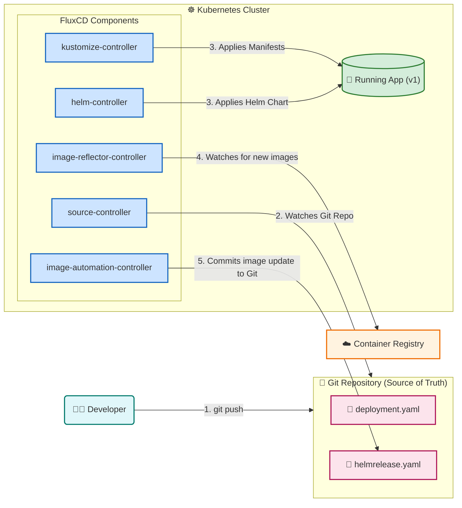

# 🔁 FluxCD GitOps Workflow

This diagram explains how FluxCD uses Git as the single source of truth to manage and deploy applications to a Kubernetes cluster.

```mermaid
flowchart LR
    %% --- Style Definitions ---
    classDef devStyle fill:#e0f7fa,stroke:#00796b,stroke-width:2px,color:#333
    classDef gitStyle fill:#fce4ec,stroke:#ad1457,stroke-width:2px,color:#333
    classDef fluxStyle fill:#cde4ff,stroke:#1565c0,stroke-width:2px,color:#333
    classDef clusterStyle fill:#d4edda,stroke:#2e7d32,stroke-width:2px,color:#333
    classDef registryStyle fill:#fff3e0,stroke:#ef6c00,stroke-width:2px,color:#333

    %% --- Actors and Systems ---
    Developer("👨‍💻 Developer")
    
    subgraph GitRepo["🐙 Git Repository (Source of Truth)"]
        direction LR
        Manifests["📄 deployment.yaml"]
        HelmRelease["📄 helmrelease.yaml"]
    end
    
    subgraph Cluster["☸️ Kubernetes Cluster"]
        direction TB
        subgraph Flux["FluxCD Components"]
            direction LR
            SourceCtrl[source-controller]
            KustomizeCtrl[kustomize-controller]
            HelmCtrl[helm-controller]
            ImageReflector[image-reflector-controller]
            ImageAutomation[image-automation-controller]
        end
        App[("🚀 Running App (v1)")]
    end

    Registry["☁️ Container Registry"]

    %% --- Connections ---
    Developer -- "1. git push" --> GitRepo
    SourceCtrl -- "2. Watches Git Repo" --> GitRepo
    KustomizeCtrl -- "3. Applies Manifests" --> App
    HelmCtrl -- "3. Applies Helm Chart" --> App
    ImageReflector -- "4. Watches for new images" --> Registry
    ImageAutomation -- "5. Commits image update to Git" --> HelmRelease

    %% --- Apply Styles ---
    class Developer devStyle
    class Manifests,HelmRelease gitStyle
    class SourceCtrl,KustomizeCtrl,HelmCtrl,ImageReflector,ImageAutomation fluxStyle
    class App clusterStyle
    class Registry registryStyle
```

