# 🚀 GitHub Actions for Kubernetes Deployment

This diagram explains how GitHub Actions can automate the deployment of applications to a Kubernetes cluster using `kubectl`.

```mermaid
flowchart TB
    %% --- Style Definitions ---
    classDef githubStyle fill:#e0f7fa,stroke:#00796b,stroke-width:2px,color:#333
    classDef actionStyle fill:#cde4ff,stroke:#1565c0,stroke-width:2px,color:#333
    classDef k8sStyle fill:#d4edda,stroke:#2e7d32,stroke-width:2px,color:#333

    %% --- Components ---
    subgraph GitHub
        direction TB
        Developer("👨‍💻 Developer")
        Repo["⭐ GitHub Repository<br>(Contains k8s YAML files)"]
        Workflow["⚙️ GitHub Actions Workflow<br>(.github/workflows/k8s-deploy.yaml)"]
    end

    subgraph ActionsRunner["GitHub Actions Runner"]
        direction TB
        Checkout["1. Checkout Code"]
        SetupKubectl["2. Set up Kubectl<br>(Uses KUBECONFIG secret)"]
        Apply["3. Run `kubectl apply -f ...`"]
    end

    subgraph Cluster["☸️ Kubernetes Cluster"]
        direction TB
        APIServer["🌀 API Server"]
        Deployment["⚙️ Deployment"]
    end

    %% --- Connections ---
    Developer -- "1. git push" --> Repo
    Repo -- "2. Triggers" --> Workflow
    Workflow -- "3. Runs on" --> ActionsRunner
    
    Checkout --> SetupKubectl --> Apply
    
    Apply -- "4. Sends manifest to" --> APIServer
    APIServer -- "5. Creates/Updates" --> Deployment

    %% --- Apply Styles ---
    class Developer,Repo,Workflow githubStyle
    class Checkout,SetupKubectl,Apply actionStyle
    class APIServer,Deployment k8sStyle
```

### How to Explain This Diagram:

1.  **The Trigger**: The workflow starts when a developer pushes code changes (especially changes to the Kubernetes YAML files) to the GitHub repository.

2.  **The Workflow File**: GitHub detects the push and runs the job defined in your `.github/workflows/k8s-deploy.yaml` file on a GitHub Actions runner.

3.  **Workflow Steps**:
    *   **Checkout Code**: The runner first downloads a copy of your repository's code.
    *   **Set up Kubectl**: It then configures `kubectl` with the credentials needed to access your cluster. These credentials (the `kubeconfig` file) should be stored securely as a **GitHub Secret**.
    *   **Run `kubectl apply`**: Finally, the runner executes the `kubectl apply` command, pointing it to the YAML files in your repository.

4.  **The Deployment**: `kubectl` sends the YAML manifest to the Kubernetes **API Server**, which then creates or updates the **Deployment** object in the cluster, rolling out your new application version.

This diagram provides a clear, step-by-step guide to automating Kubernetes deployments, which will be a valuable lesson for your students.
