# 🚀 GitHub Actions for Docker Build & Push

This diagram explains how GitHub Actions can automate the process of building a Docker image, tagging it, and pushing it to a container registry (like Docker Hub or GitHub Container Registry).

```mermaid
flowchart TB
    %% --- Style Definitions ---
    classDef githubStyle fill:#e0f7fa,stroke:#00796b,stroke-width:2px,color:#333
    classDef actionStyle fill:#cde4ff,stroke:#1565c0,stroke-width:2px,color:#333
    classDef dockerStyle fill:#d4edda,stroke:#2e7d32,stroke-width:2px,color:#333
    classDef registryStyle fill:#fff3e0,stroke:#ef6c00,stroke-width:2px,color:#333

    %% --- Components ---
    GitHub["⭐ GitHub Repository"]
    Workflow["⚙️ GitHub Actions Workflow<br>(.github/workflows/docker-build-push.yaml)"]

    subgraph Actions["Workflow Steps"]
        direction TB
        Checkout["1. Checkout Code<br>(actions/checkout@v3)"]
        Login["2. Docker Login<br>(docker/login-action@v2)"]
        Build["3. Docker Build<br>(docker/build-push-action@v3)"]
        Push["4. Docker Push<br>(docker/build-push-action@v3)"]
    end

    Registry["☁️ Container Registry<br>(Docker Hub, GHCR, etc.)"]

    %% --- Connections ---
    GitHub -- "1. Code Push/PR" --> Workflow
    Workflow -- "2. Runs on GitHub Actions" --> Checkout
    Checkout --> Login
    Login --> Build
    Build --> Push
    Push -- "Pushes Image" --> Registry

    %% --- Apply Styles ---
    class GitHub githubStyle
    class Workflow actionStyle
    class Checkout,Login,Build,Push actionStyle
    class Registry registryStyle
```

### How to Explain This Diagram:

1.  **The Trigger**: The workflow starts when someone pushes code to your GitHub repository or creates a pull request.

2.  **The Workflow**: This is your `docker-build-push.yaml` file that defines the automated process.

3.  **Workflow Steps**:
    *   **Checkout Code**: The workflow first checks out your code from the repository.
    *   **Docker Login**: It then logs in to your container registry using credentials stored as GitHub secrets.
    *   **Docker Build**: This step builds the Docker image from your `Dockerfile`.
    *   **Docker Push**: Finally, the workflow pushes the newly built image to your container registry, tagging it with a version number or Git commit hash.