# ⚙️ How Helm Works: From Chart to Release

This diagram explains how Helm acts as a package manager for Kubernetes, bundling YAML files into reusable "Charts" and managing their deployment as "Releases".

```mermaid
flowchart TB
    %% --- Style Definitions ---
    classDef userStyle fill:#e0f7fa,stroke:#00796b,stroke-width:2px,color:#333
    classDef helmStyle fill:#cde4ff,stroke:#1565c0,stroke-width:2px,color:#333
    classDef chartStyle fill:#f3e5f5,stroke:#6a1b9a,stroke-width:2px,color:#333
    classDef k8sStyle fill:#d4edda,stroke:#2e7d32,stroke-width:2px,color:#333

    %% --- Components ---
    User("👨‍💻 You")
    HelmCLI["`helm install my-app ./my-chart`"]

    subgraph Chart["📦 Helm Chart (`./my-chart`)"]
        direction LR
        Templates["📄 Templates<br>(deployment.yaml, service.yaml)"]
        Values["📄 values.yaml<br>(Default Config)"]
    end
    
    subgraph K8s["☸️ Kubernetes Cluster"]
        direction TB
        Release["🚀 Release: `my-app`<br>(Running instance of the chart)"]
        subgraph K8sObjects["Created Kubernetes Objects"]
            direction LR
            Deployment["⚙️ Deployment"]
            Service["🌐 Service"]
        end
        Release --> K8sObjects
    end

    %% --- Connections ---
    User -- "1. Runs command" --> HelmCLI
    HelmCLI -- "2. Reads Chart & Renders Templates" --> Chart
    HelmCLI -- "3. Installs/Upgrades in Cluster" --> Release

    %% --- Apply Styles ---
    class User userStyle
    class HelmCLI helmStyle
    class Templates,Values chartStyle
    class K8s,Release,Deployment,Service k8sStyle
```

Click to see how to explain this diagram

### How to Explain This Diagram:

1.  **The User & The Helm CLI**: The process starts when you run a command like `helm install`. Helm is your command-line tool for managing Kubernetes applications.

2.  **The Helm Chart**:
    *   A **Chart** is a package or a folder containing all the necessary files to deploy an application.
    *   **`templates/`**: This folder contains standard Kubernetes YAML files (like `deployment.yaml`, `service.yaml`), but with placeholders. For example, instead of `replicas: 3`, it might say `replicas: {{ .Values.replicaCount }}`.
    *   **`values.yaml`**: This file provides the **default values** for all the placeholders in the templates. For example, it might contain `replicaCount: 1`.

3.  **Rendering and Installation**:
    *   When you run `helm install`, Helm's "render engine" reads the templates and injects the values from `values.yaml` (and any overrides you provide on the command line).
    *   This process generates the final, valid Kubernetes YAML manifests.
    *   Helm then sends these manifests to the Kubernetes API server.

4.  **The Release**:
    *   A **Release** is a running instance of a chart in your cluster. When Helm installs the manifests, it creates a release with a specific name (e.g., `my-app`).
    *   This release tracks all the Kubernetes objects (Deployments, Services, etc.) that were created from the chart. This is how Helm knows what to upgrade or delete when you run `helm upgrade` or `helm uninstall`.

