# ⚖️ HPA vs. VPA: Kubernetes Autoscaling Explained

This document explains the two main ways Kubernetes can automatically scale your applications: **Horizontal Pod Autoscaling (HPA)** and **Vertical Pod Autoscaling (VPA)**. The goal of both is to match the resources allocated to your application with its actual demand.

---

## Visualizing the Difference

This diagram shows the core difference between scaling "out" (HPA) and scaling "up" (VPA).

```mermaid
graph TD
    subgraph "Horizontal Pod Autoscaler (HPA) - Scales Out"
        direction LR
        HPA_CPU["High CPU Usage<br>(e.g., > 80%)"] -- "Triggers" --> HPA_Action["HPA adds more Pods"]
        
        subgraph Before_HPA["Before (1 Pod)"]
            H_Pod1["Pod<br>requests: 1 CPU"]
        end

        subgraph After_HPA["After (3 Pods)"]
            H_Pod2["Pod<br>requests: 1 CPU"]
            H_Pod3["Pod<br>requests: 1 CPU"]
            H_Pod4["Pod<br>requests: 1 CPU"]
        end
        
        Before_HPA -- "Load increases" --> HPA_CPU
        HPA_Action --> After_HPA
    end

    subgraph "Vertical Pod Autoscaler (VPA) - Scales Up"
        direction LR
        VPA_Mem["High Memory Usage"] -- "Triggers" --> VPA_Action["VPA gives Pod more resources"]
        
        subgraph Before_VPA["Before (Pod is too small)"]
            V_Pod1["Pod<br>requests: 2Gi Memory"]
        end

        subgraph After_VPA["After (Pod is resized)"]
            V_Pod2["Pod<br>requests: 4Gi Memory"]
        end
        
        Before_VPA -- "App needs more memory" --> VPA_Mem
        VPA_Action -- "Restarts Pod with new size" --> After_VPA
    end

    style Before_HPA,Before_VPA fill:#e3f2fd,stroke:#0d47a1
    style After_HPA,After_VPA fill:#dcedc8,stroke:#558b2f
```

### How to Explain This Diagram:

1.  **Horizontal Pod Autoscaler (HPA)**:
    *   **What it does**: Increases the number of Pods (replicas). It scales **out** by adding more copies of your application.
    *   **Analogy**: If a single cashier is overwhelmed, HPA opens more checkout lanes with more cashiers. Each cashier has the same capability, but now you have more of them to handle the load.
    *   **Trigger**: It's triggered when a metric like average CPU or memory utilization across all pods exceeds a target you define.
    *   **Best for**: Stateless applications that can easily share load, like web servers or API backends.

2.  **Vertical Pod Autoscaler (VPA)**:
    *   **What it does**: Increases the CPU or memory resources (`requests` and `limits`) for existing Pods. It scales **up** by making each Pod more powerful.
    *   **Analogy**: If a single cashier is struggling, VPA gives them a faster scanner and more counter space. It's still just one cashier, but they are now more powerful.
    *   **Trigger**: It analyzes the historical resource usage of a Pod and determines the optimal CPU and memory requests.
    *   **Important**: In its default mode, VPA will **restart** the Pod to apply the new, larger resource requests.
    *   **Best for**: Stateful applications or jobs that can't be easily scaled horizontally (e.g., a database like MySQL, or a memory-intensive data processing job).

---

## Key Differences Summary

| Feature           | Horizontal Pod Autoscaler (HPA) | Vertical Pod Autoscaler (VPA)                               |
| ----------------- | ------------------------------- | ----------------------------------------------------------- |
| **Action**        | Changes the number of Pods      | Changes the CPU/Memory requests of existing Pods            |
| **Scaling Type**  | Scales "Out" / "In"             | Scales "Up" / "Down"                                        |
| **Impact**        | New Pods are created/deleted    | Pods are restarted to apply new resource sizes              |
| **Primary Use**   | Handling variable traffic load  | "Right-sizing" applications that are over/under-provisioned |
| **Works Best On** | Stateless applications          | Stateful applications, single-instance jobs                 |

### ⚠️ Important Note

You **cannot** use HPA and VPA on the same set of pods with the same metrics (CPU or memory) at the same time. They will conflict with each other, with HPA trying to add pods and VPA trying to resize them, leading to unstable behavior.

A common pattern is to use VPA in "recommendation" mode to find the optimal pod size, apply that size to your Deployment, and then use HPA to scale the number of those right-sized pods.