# 🔥 Understanding Incident Management

This document explains **Incident Management**. An incident is any unplanned event that disrupts or reduces the quality of a service. The goal of incident management is to restore normal service operation as quickly as possible and to minimize the impact on the business.

---

## The Incident Management Lifecycle

This diagram shows the phases of responding to an active incident.

```mermaid
flowchart TD
    %% --- Style Definitions ---
    classDef detect fill:#fdecea,stroke:#b71c1c
    classDef respond fill:#fff3e0,stroke:#e65100
    classDef resolve fill:#e8f5e9,stroke:#1b5e20
    classDef post fill:#e3f2fd,stroke:#0d47a1

    %% --- Components ---
    A("🚨 Detection")
    B("🗣️ Response")
    C("🩺 Triage & Mitigation")
    D("🔧 Resolution")
    E("📖 Postmortem")

    %% --- Connections ---
    A -- "Alert fires / User reports issue" --> B
    B -- "Assemble team, declare incident" --> C
    C -- "Find temporary fix (e.g., restart server)" --> D
    D -- "Apply permanent fix (e.g., deploy hotfix)" --> E
    E -- "Document learnings to prevent future incidents" --> A

    %% --- Apply Styles ---
    class A detect;
    class B,C respond;
    class D resolve;
    class E post;
```

### How to Explain This Diagram:

1.  **Detection**: The incident begins. This is when an automated alert fires (e.g., "CPU usage is at 99%!") or a customer reports a problem.

2.  **Response**: The on-call engineer acknowledges the alert and declares an official incident. A communication channel (like a Slack channel or a conference call) is opened, and the right people are brought in to help. An **Incident Commander (IC)** is assigned to lead the response.

3.  **Triage & Mitigation**: This is the "stop the bleeding" phase. The team works quickly to understand the impact and find a temporary fix to reduce the impact on users.
    *   **Triage**: How bad is it? Who is affected?
    *   **Mitigation**: Can we restart the service? Can we fail over to a backup? The goal is to make the system usable again, even if the root cause isn't fixed yet.

4.  **Resolution**: Once the service is stable, the team works on a permanent fix for the root cause. This might involve writing new code, fixing a configuration, or patching a server. The incident is considered "resolved" when the permanent fix is deployed.

5.  **Postmortem (or Post-Incident Review)**: This is the most important step for learning. After the incident is over, the team writes a document that details:
    *   A timeline of what happened.
    *   The root cause of the problem.
    *   What went well and what went poorly during the response.
    *   **Action Items**: A list of concrete tasks to prevent this exact class of incident from happening again.

This blameless postmortem process is critical for building more resilient and reliable systems over time.

---

### Key Roles

*   **Incident Commander (IC)**: The leader of the incident response. They don't fix the problem themselves; they manage the overall effort, handle communication, and make sure the team is working effectively.
*   **Subject Matter Expert (SME)**: The engineers who have deep knowledge of the affected system and work on the technical fix.