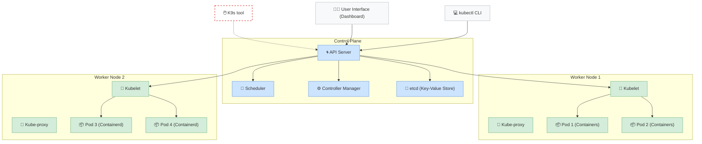

# 🧩 Kubernetes Architecture 

```mermaid
flowchart TB
    %% --- Style Definitions ---
    classDef cpStyle fill:#cde4ff,stroke:#99bde5,stroke-width:2px,color:#333
    classDef workerStyle fill:#d4edda,stroke:#a3d0a8,stroke-width:2px,color:#333
    classDef clientStyle fill:#f8f9fa,stroke:#d3d6d8,stroke-width:2px,color:#333

    %% --- Control Plane ---
    subgraph CP[Control Plane]
        APIServer["🌀 API Server"]
        Scheduler["🧭 Scheduler"]
        Controller["⚙️ Controller Manager"]
        ETCD["💾 etcd (Key-Value Store)"]
    end

    %% --- Worker Node 1 ---
    subgraph Node1[Worker Node 1]
        Kubelet1["🧩 Kubelet"]
        KProxy1["🔀 Kube-proxy"]
        Pod1["📦 Pod 1 (Containers)"]
        Pod2["📦 Pod 2 (Containers)"]
    end

    %% --- Worker Node 2 ---
    subgraph Node2[Worker Node 2]
        Kubelet2["🧩 Kubelet"]
        KProxy2["🔀 Kube-proxy"]
        Pod3["📦 Pod 3 (Containerd)"]
        Pod4["📦 Pod 4 (Containerd)"]
    end

    %% --- External Clients ---
    Kubectl["💻 kubectl CLI"]
    User["👨‍💻 User Interface (Dashboard)"]

    %% --- Explanatory Pointer ---
    Pointer["🖱️ K9s tool "]
    style Pointer fill:#fff,stroke:#d9534f,stroke-width:2px,stroke-dasharray: 5 5

    %% --- Apply Styles ---
    class APIServer,Scheduler,Controller,ETCD cpStyle
    class Kubelet1,KProxy1,Pod1,Pod2 workerStyle
    class Kubelet2,KProxy2,Pod3,Pod4 workerStyle
    class Kubectl,User clientStyle

    %% --- Connections ---
    Pointer-.->APIServer
    User --> APIServer
    Kubectl --> APIServer
    APIServer --> Scheduler
    APIServer --> Controller
    APIServer --> ETCD
    APIServer --> Kubelet1
    Kubelet1 --> Pod1
    Kubelet1 --> Pod2
    APIServer --> Kubelet2
    Kubelet2 --> Pod3
    Kubelet2 --> Pod4
```
