# 🌐 Kubernetes Networking Architecture

This diagram explains the core concepts of Kubernetes networking, including how Pods communicate with each other and how external traffic reaches applications inside the cluster.

```mermaid
flowchart TB
    %% --- Style Definitions ---
    classDef userStyle fill:#e0f7fa,stroke:#00796b,stroke-width:2px,color:#333
    classDef ingressStyle fill:#f3e5f5,stroke:#6a1b9a,stroke-width:2px,color:#333
    classDef serviceStyle fill:#cde4ff,stroke:#1565c0,stroke-width:2px,color:#333
    classDef podStyle fill:#fff3e0,stroke:#ef6c00,stroke-width:2px,color:#333
    classDef nodeStyle fill:#d4edda,stroke:#2e7d32,stroke-width:2px,color:#333

    %% --- Components ---
    User("👩‍💻 External User")

    subgraph Cluster["☸️ Kubernetes Cluster"]
        direction TB
        
        Ingress["🚦 Ingress<br>(e.g., my-app.com)"]
        Service["🌐 Service (ClusterIP)<br>Groups Pods with label 'app=my-app'"]

        subgraph Node1["🖥️ Worker Node 1"]
            direction TB
            PodA["📦 Pod A<br>(IP: 10.1.1.2)"]
            PodB["📦 Pod B<br>(IP: 10.1.1.3)"]
        end

        subgraph Node2["🖥️ Worker Node 2"]
            direction TB
            PodC["📦 Pod C<br>(IP: 10.1.2.2)"]
        end
        
        CNI["🔌 CNI Plugin (e.g., Calico)<br>Manages network between nodes"]
    end

    %% --- Connections ---
    User -- "1. Accesses my-app.com" --> Ingress
    Ingress -- "2. Forwards traffic to" --> Service
    Service -- "3. Load balances to" --> PodA & PodC
    
    PodA <--> CNI
    PodB <--> CNI
    PodC <--> CNI
    CNI -- "4. Pod-to-Pod Communication" --> CNI

    %% --- Apply Styles ---
    class User userStyle
    class Ingress ingressStyle
    class Service serviceStyle
    class PodA,PodB,PodC podStyle
    class Node1,Node2,CNI nodeStyle
```

### How to Explain This Diagram:

1.  **External Traffic (User to Ingress)**: The process starts when a user tries to access your application (e.g., `my-app.com`). This request first hits an **Ingress**, which acts as the traffic manager or entry point for the cluster.

2.  **Ingress to Service**: The Ingress checks its rules and sees that traffic for `my-app.com` should be sent to a specific **Service**.

3.  **Service to Pods**: The **Service** is a stable network endpoint that finds all the Pods with a specific label (e.g., `app=my-app`). It then load-balances the traffic to one of these healthy Pods (`Pod A` or `Pod C`), no matter which node they are on. This is the magic of Kubernetes service discovery!

4.  **Pod-to-Pod Communication (CNI)**:
    *   Every Pod gets its own unique IP address within the cluster (e.g., `10.1.1.2`).
    *   The **CNI (Container Network Interface) plugin** is a special piece of software (like Calico or Flannel) that creates a virtual network across all the nodes.
    *   This allows any Pod to communicate directly with any other Pod using its IP address, even if they are on different worker nodes. The CNI handles all the complex routing automatically.

This diagram provides a clear, high-level overview of the Kubernetes networking model, making it much easier for your students to grasp these important concepts.

