# 🏷️ Kubernetes Namespaces Explained

This diagram explains how Kubernetes uses **Namespaces** to create virtual clusters inside a single physical cluster. This is perfect for organizing resources and separating environments like `dev` and `prod`.

```mermaid
flowchart TB
    %% --- Style Definitions ---
    classDef clusterStyle fill:#d4edda,stroke:#2e7d32,stroke-width:2px,color:#333
    classDef nsStyle fill:#e9ecef,stroke:#868e96,stroke-width:2px,color:#333
    classDef devStyle fill:#cde4ff,stroke:#1565c0,stroke-width:1px,color:#333
    classDef prodStyle fill:#fff3e0,stroke:#ef6c00,stroke-width:1px,color:#333
    classDef systemStyle fill:#f8d7da,stroke:#721c24,stroke-width:1px,color:#333

    %% --- Main Cluster ---
    subgraph Cluster["☸️ Kubernetes Cluster"]
        direction TB

        %% --- Namespaced Resources ---
        subgraph DevNS["ns: dev"]
            direction LR
            DevApp["⚙️ Deployment<br>my-app"]
            DevSvc["🌐 Service<br>my-app-svc"]
        end

        subgraph ProdNS["ns: prod"]
            direction LR
            ProdApp["⚙️ Deployment<br>my-app"]
            ProdSvc["🌐 Service<br>my-app-svc"]
        end

        subgraph SystemNS["ns: kube-system"]
            direction LR
            ApiServerPod["📦 kube-apiserver"]
            CoreDNSPod["📦 coredns"]
        end

        %% --- Cluster-Scoped (Non-Namespaced) Resources ---
        subgraph ClusterScope["Cluster-Scoped Resources (No Namespace)"]
            Node1["🖥️ Node 1"]
            Node2["🖥️ Node 2"]
            SC["💾 StorageClass"]
        end

        %% --- Connections & Isolation ---
        DevApp -- "Can access by name" --> DevSvc
        ProdApp -- "Can access by name" --> ProdSvc
        DevApp -.->|"❌ CANNOT access by name"| ProdSvc
    end

    %% --- Apply Styles ---
    class Cluster clusterStyle
    class DevNS,DevApp,DevSvc devStyle
    class ProdNS,ProdApp,ProdSvc prodStyle
    class SystemNS,ApiServerPod,CoreDNSPod systemStyle
    class Node1,Node2,SC nsStyle
```

### How to Explain This Diagram:

1.  **What is a Namespace?**: Think of a namespace as a "virtual cluster" or a folder inside your main Kubernetes cluster. It lets you group related resources together.

2.  **Resource Isolation**:
    *   Notice that both the `dev` and `prod` namespaces have a Deployment named `my-app`. This is possible because names only need to be unique **within a namespace**.
    *   A Pod in the `dev` namespace can easily find a Service named `my-app-svc` in its own namespace.
    *   However, that same `dev` Pod **cannot** directly access the `my-app-svc` in the `prod` namespace just by its name. This prevents accidental cross-environment communication. (To communicate across namespaces, you must use the full DNS name, like `my-app-svc.prod.svc.cluster.local`).

3.  **Default Namespaces**:
    *   **`kube-system`**: This is where the core components of Kubernetes itself live, like the API server and CoreDNS. You should generally not touch this namespace.
    *   **`default`**: If you create a resource (like a Pod) without specifying a namespace, Kubernetes puts it here. It's good for quick tests but not for real applications.

4.  **Cluster-Scoped Resources**:
    *   Some resources, like `Nodes` and `StorageClasses`, do not live inside any namespace. They are global to the entire cluster. This makes sense because all namespaces share the same physical nodes and storage definitions.

