# ⚙️ Kubernetes Workloads: Deployment vs. StatefulSet vs. DaemonSet

This diagram explains the key differences between the three main Kubernetes workload controllers and how they interact with Services.

```mermaid
flowchart LR
    %% --- Style Definitions ---
    classDef serviceStyle fill:#cde4ff,stroke:#1565c0,stroke-width:2px,color:#333
    classDef deployStyle fill:#d4edda,stroke:#2e7d32,stroke-width:2px,color:#333
    classDef statefulStyle fill:#fff3e0,stroke:#ef6c00,stroke-width:2px,color:#333
    classDef daemonStyle fill:#f3e5f5,stroke:#6a1b9a,stroke-width:2px,color:#333
    classDef podStyle fill:#e9ecef,stroke:#868e96,stroke-width:1px,color:#333
    classDef storageStyle fill:#f8f9fa,stroke:#adb5bd,stroke-width:2px,color:#333

    %% --- Deployment (Stateless Apps) ---
    subgraph S1[Deployment: For Stateless Apps]
        direction TB
        Service1["🌐 Service<br>(Load Balancer)"]
        Deployment["⚙️ Deployment Controller"]
        subgraph Pods1["Replica Pods (Identical)"]
            direction TB
            PodA["📦 Pod<br>(app-xyz)"]
            PodB["📦 Pod<br>(app-abc)"]
        end
        Deployment -- "Manages" --> Pods1
        Service1 -- "Load Balances Traffic" --> Pods1
    end

    %% --- StatefulSet (Stateful Apps) ---
    subgraph S2[StatefulSet: For Stateful Apps]
        direction TB
        Service2["🌐 Headless Service<br>(Stable Network ID)"]
        StatefulSet["⚙️ StatefulSet Controller"]
        subgraph Pods2["Replica Pods (Unique & Ordered)"]
            direction TB
            Pod0["📦 Pod<br>(db-0)"]
            Pod1["📦 Pod<br>(db-1)"]
        end
        PVC0["📄 PVC-0"]
        PVC1["📄 PVC-1"]
        StatefulSet -- "Manages" --> Pods2
        Service2 -.-> Pods2
        Pod0 --- PVC0
        Pod1 --- PVC1
    end

    %% --- DaemonSet (Node-level Agents) ---
    subgraph S3[DaemonSet: One Pod Per Node]
        direction TB
        DaemonSet["⚙️ DaemonSet Controller"]
        Node1["🖥️ Worker Node 1"]
        Node2["🖥️ Worker Node 2"]
        DaemonSet -- "Ensures Pod on" --> Node1
        DaemonSet -- "Ensures Pod on" --> Node2
        PodLog1["📦 Pod<br>(log-agent-jkl)"]
        PodLog2["📦 Pod<br>(log-agent-pqr)"]
        Node1 --> PodLog1
        Node2 --> PodLog2
    end

    %% --- Vertical Layout ---
    S1 --> S2 --> S3

    %% --- Apply Styles ---
    class Deployment,PodA,PodB deployStyle
    class StatefulSet,Pod0,Pod1 statefulStyle
    class DaemonSet,PodLog1,PodLog2,Node1,Node2 daemonStyle
    class Service1,Service2 serviceStyle
    class PVC0,PVC1 storageStyle
```

### Key Differences Explained:

*   **Deployment**:
    *   **Use Case**: Best for **stateless** applications (e.g., web servers, APIs) where any Pod can handle any request.
    *   **Pods**: Pods are interchangeable and have random names.
    *   **Service**: Typically uses a regular `Service` to load-balance traffic across its Pods.

*   **StatefulSet**:
    *   **Use Case**: Best for **stateful** applications (e.g., databases, message queues) that require stable identity and storage.
    *   **Pods**: Pods have stable, predictable names (e.g., `db-0`, `db-1`) and are created and scaled in order.
    *   **Storage**: Each Pod gets its own unique `PersistentVolumeClaim` (PVC), ensuring its data is preserved across restarts.
    *   **Service**: Typically uses a `Headless Service` to give each Pod a unique, stable DNS address, allowing other applications to connect to a specific replica.

*   **DaemonSet**:
    *   **Use Case**: Best for cluster-wide agents that need to run on every node (or a subset of nodes). Examples include logging agents (like Fluentd), monitoring agents (like Prometheus Node Exporter), or network plugins.
    *   **Pods**: Ensures that one Pod replica runs on each node in the cluster. When a new node is added, the DaemonSet automatically deploys a Pod to it.