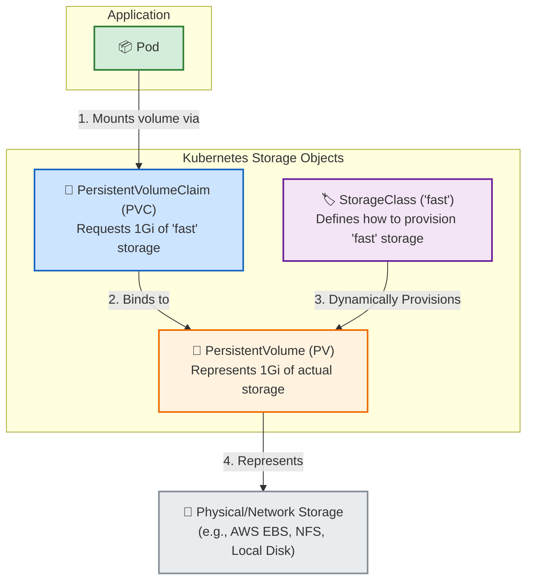

# 💾 Kubernetes Storage Concepts (PV, PVC, SC)

This diagram explains how Pods consume persistent storage in Kubernetes using PersistentVolumeClaims, PersistentVolumes, and StorageClasses.

```mermaid
flowchart TB
    %% --- Style Definitions ---
    classDef podStyle fill:#d4edda,stroke:#2e7d32,stroke-width:2px,color:#333
    classDef pvcStyle fill:#cde4ff,stroke:#1565c0,stroke-width:2px,color:#333
    classDef pvStyle fill:#fff3e0,stroke:#ef6c00,stroke-width:2px,color:#333
    classDef scStyle fill:#f3e5f5,stroke:#6a1b9a,stroke-width:2px,color:#333
    classDef storageStyle fill:#e9ecef,stroke:#868e96,stroke-width:2px,color:#333

    %% --- Components ---
    subgraph App["Application"]
        Pod["📦 Pod"]
    end

    subgraph K8sStorage["Kubernetes Storage Objects"]
        PVC["📄 PersistentVolumeClaim (PVC)<br>Requests 1Gi of 'fast' storage"]
        PV["💾 PersistentVolume (PV)<br>Represents 1Gi of actual storage"]
        SC["🏷️ StorageClass ('fast')<br>Defines how to provision 'fast' storage"]
    end

    PhysicalStorage["💽 Physical/Network Storage<br>(e.g., AWS EBS, NFS, Local Disk)"]

    %% --- Connections ---
    Pod -- "1. Mounts volume via" --> PVC
    PVC -- "2. Binds to" --> PV
    PV -- "4. Represents" --> PhysicalStorage
    SC -- "3. Dynamically Provisions" --> PV

    %% --- Apply Styles ---
    class Pod podStyle
    class PVC pvcStyle
    class PV pvStyle
    class SC scStyle
    class PhysicalStorage storageStyle
```

