# 🐶 K9s: The Kubernetes CLI on Steroids

This diagram explains what K9s is and how it provides a powerful terminal user interface (TUI) to interact with your Kubernetes cluster, making management faster and easier.

```mermaid
flowchart LR
    %% --- Style Definitions ---
    classDef userStyle fill:#e0f7fa,stroke:#00796b,stroke-width:2px,color:#333
    classDef k9sStyle fill:#cde4ff,stroke:#1565c0,stroke-width:2px,color:#333
    classDef k8sStyle fill:#d4edda,stroke:#2e7d32,stroke-width:2px,color:#333

    %% --- Components ---
    subgraph YourTerminal [Your Terminal]
        User("👨‍💻 You") -- "Launches 'k9s'" --> K9sUI["🐶 K9s UI<br>(Real-time Dashboard)"]
    end

    subgraph Cluster["☸️ Kubernetes Cluster"]
        APIServer["🌀 API Server"]
        ClusterObjects["- Pods<br>- Services<br>- Deployments<br>- etc."]
    end

    %% --- Connections ---
    K9sUI -- "Sends API calls (like kubectl)" --> APIServer
    APIServer -- "Manages" --> ClusterObjects

    %% --- Apply Styles ---
    class User userStyle
    class K9sUI k9sStyle
    class APIServer,ClusterObjects k8sStyle
```

### What is K9s?

**K9s** is a tool that runs in your terminal and gives you a full-screen, real-time user interface for your Kubernetes cluster. Instead of typing `kubectl get pods`, `kubectl logs my-pod`, and `kubectl describe pod my-pod`, you can do it all with single keystrokes while seeing everything update live.

### Key Advantages

*   **Real-time View**: See the status of your pods, deployments, and services update automatically.
*   **Easy Navigation**: Quickly jump between different resources (like from a Deployment to its Pods).
*   **Fast Actions**: View logs, shell into containers, and delete resources with a single key press.
*   **Error Highlighting**: Failing or crashing pods are highlighted in red, so you can spot problems instantly.
*   **Resource Usage**: Easily view CPU and Memory usage for pods and nodes.

### Common Shortcuts

| Key(s)      | Action                                     |
|-------------|--------------------------------------------|
| `:pods`     | Go to the Pods view                        |
| `:svc`      | Go to the Services view                    |
| `:deploy`   | Go to the Deployments view                 |
| `l`         | View **l**ogs for the selected Pod         |
| `s`         | **S**hell into the selected Pod/Container  |
| `d`         | **D**escribe the selected resource         |
| `Ctrl+d`    | **D**elete the selected resource (with confirmation) |
| `/`         | Filter the current view by name            |
| `Esc`       | Go back to the previous view               |
| `?`         | Show the help menu with all shortcuts      |