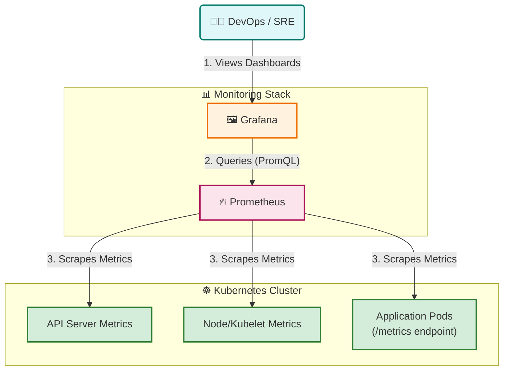

# 📊 Kubernetes Monitoring with Prometheus & Grafana

This diagram explains how Prometheus and Grafana work together to monitor a Kubernetes cluster.

```mermaid
flowchart TB
    %% --- Style Definitions ---
    classDef userStyle fill:#e0f7fa,stroke:#00796b,stroke-width:2px,color:#333
    classDef grafanaStyle fill:#fff3e0,stroke:#ef6c00,stroke-width:2px,color:#333
    classDef promStyle fill:#fce4ec,stroke:#ad1457,stroke-width:2px,color:#333
    classDef k8sStyle fill:#d4edda,stroke:#2e7d32,stroke-width:2px,color:#333

    %% --- Actors and Systems ---
    User("👨‍💻 DevOps / SRE")

    subgraph K8s["☸️ Kubernetes Cluster"]
        direction LR
        APIServer["API Server Metrics"]
        Kubelet["Node/Kubelet Metrics"]
        AppPods["Application Pods </br> (/metrics endpoint)"]
    end

    subgraph MonitoringStack["📊 Monitoring Stack"]
        direction TB
        Grafana["🖼️ Grafana"]
        Prometheus["🔥 Prometheus"]
    end

    %% --- Connections ---
    User -- "1. Views Dashboards" --> Grafana
    Grafana -- "2. Queries (PromQL)" --> Prometheus
    Prometheus -- "3. Scrapes Metrics" --> APIServer
    Prometheus -- "3. Scrapes Metrics" --> Kubelet
    Prometheus -- "3. Scrapes Metrics" --> AppPods

    %% --- Apply Styles ---
    class User userStyle
    class Grafana grafanaStyle
    class Prometheus promStyle
    class Kubelet,APIServer,AppPods k8sStyle
```

