# 🔐 Kubernetes RBAC Explained (Role-Based Access Control)

This document explains how Kubernetes uses **Role-Based Access Control (RBAC)** to control who can do what within a cluster. RBAC is the primary mechanism for securing a Kubernetes cluster.

The core idea of RBAC is to answer three questions:
1.  **Who** is making the request? (The `Subject`)
2.  **What** are they trying to do? (The `Role`)
3.  **How** do we connect the "Who" to the "What"? (The `Binding`)

---

## Visualizing RBAC Components

This diagram shows how a `RoleBinding` connects a `ServiceAccount` (the "who") to a `Role` (the "what").

```mermaid
flowchart TD
    %% --- Style Definitions ---
    classDef subject fill:#e0f7fa,stroke:#00796b
    classDef role fill:#fff3e0,stroke:#ef6c00
    classDef binding fill:#dcedc8,stroke:#558b2f

    %% --- Components ---
    subgraph "WHO? (The Subject)"
        SA["👤 ServiceAccount<br><i>'app-reader'</i>"]
    end

    subgraph "WHAT can they do? (The Role)"
        R["📜 Role: 'pod-reader'<br><br><b>Verbs:</b> get, watch, list<br><b>Resources:</b> pods"]
    end

    subgraph "HOW are they connected? (The Binding)"
        RB["🔗 RoleBinding<br><i>Connects 'app-reader' to 'pod-reader'</i>"]
    end

    %% --- Connections ---
    SA -- "is the Subject of" --> RB
    R -- "is the Role referenced by" --> RB

    %% --- Apply Styles ---
    class SA subject;
    class R role;
    class RB binding;
```

<div style="transform: scale(1.2); transform-origin: top left;">



</div>

### How to Explain This Diagram:

1.  **The Subject (Who?)**: This is the entity performing an action. It can be a `User`, a `Group`, or, most commonly for in-cluster processes, a `ServiceAccount`. In our diagram, the subject is a `ServiceAccount` named `app-reader`.

2.  **The Role (What?)**: This defines a set of permissions. A `Role` contains rules that specify a list of **verbs** (like `get`, `create`, `delete`) on a set of **resources** (like `pods`, `deployments`, `services`). Our example `Role` is called `pod-reader` and it only allows reading pods.

3.  **The Binding (How?)**: This is the glue that connects a Subject to a Role. A `RoleBinding` grants the permissions defined in a `Role` to the specified `Subject`. It effectively says, "The `app-reader` ServiceAccount is now allowed to do everything defined in the `pod-reader` Role."

---

## Example YAML Files

Here are the three objects from the diagram, defined in YAML.

### 1. The `Role` (What they can do)
This `Role` only exists in the `default` namespace and allows read-only access to Pods.

```yaml
apiVersion: rbac.authorization.k8s.io/v1
kind: Role
metadata:
  namespace: default
  name: pod-reader
rules:
- apiGroups: [""] # "" indicates the core API group
  resources: ["pods"]
  verbs: ["get", "watch", "list"]
```

### 2. The `ServiceAccount` (Who is acting)
This creates an identity for our application in the `default` namespace.

```yaml
apiVersion: v1
kind: ServiceAccount
metadata:
  namespace: default
  name: app-reader
```

### 3. The `RoleBinding` (Connecting them)
This binds the `app-reader` ServiceAccount to the `pod-reader` Role within the `default` namespace.

```yaml
apiVersion: rbac.authorization.k8s.io/v1
kind: RoleBinding
metadata:
  name: read-pods-binding
  namespace: default
subjects:
- kind: ServiceAccount
  name: app-reader # Name of the ServiceAccount
  namespace: default
roleRef:
  kind: Role # Can be Role or ClusterRole
  name: pod-reader # Name of the Role to bind to
  apiGroup: rbac.authorization.k8s.io
```

### ClusterRole vs. Role

*   **`Role`**: Grants permissions **within a single namespace**.
*   **`ClusterRole`**: Grants permissions **across the entire cluster**. It can also be used for non-namespaced resources like Nodes.

Similarly, a `RoleBinding` applies to a single namespace, while a `ClusterRoleBinding` applies cluster-wide.