# 🔄 Kubernetes Rolling Updates & Rollbacks

This diagram explains how Kubernetes Deployments perform safe, zero-downtime rolling updates and how you can easily roll back to a previous version if something goes wrong.

```mermaid
flowchart TB
    %% --- Style Definitions ---
    classDef deployStyle fill:#d4edda,stroke:#2e7d32,stroke-width:2px,color:#333
    classDef v1Style fill:#cde4ff,stroke:#1565c0,stroke-width:2px,color:#333
    classDef v2Style fill:#fff3e0,stroke:#ef6c00,stroke-width:2px,color:#333

    %% --- Main Sections ---
    subgraph RollingUpdate["Part 1: Rolling Update (`kubectl apply`)"]
        direction LR
        subgraph State1["Initial State: App v1"]
            D1["⚙️ Deployment"] --> RS1["ReplicaSet v1"]
            RS1 --> P1_A["📦 Pod v1"] & P1_B["📦 Pod v1"] & P1_C["📦 Pod v1"]
        end

        subgraph State2["Update in Progress..."]
            D2["⚙️ Deployment"] --> RS1_Mid["ReplicaSet v1"] & RS2_Mid["ReplicaSet v2 (New)"]
            RS1_Mid --> P1_D["📦 Pod v1"] & P1_E["📦 Pod v1"]
            RS2_Mid --> P2_A["📦 Pod v2"]
        end

        subgraph State3["Final State: App v2"]
            D3["⚙️ Deployment"] --> RS1_End["ReplicaSet v1 (replicas: 0)"] & RS2_End["ReplicaSet v2"]
            RS2_End --> P2_B["📦 Pod v2"] & P2_C["📦 Pod v2"] & P2_D["📦 Pod v2"]
        end
    end

    subgraph Rollback["Part 2: Rollback (`kubectl rollout undo`)"]
        direction LR
        subgraph State4["Starting Rollback from v2"]
            D4["⚙️ Deployment"] --> RS1_R_Start["ReplicaSet v1 (replicas: 0)"] & RS2_R_Start["ReplicaSet v2"]
            RS2_R_Start --> P2_E["📦 Pod v2"] & P2_F["📦 Pod v2"] & P2_G["📦 Pod v2"]
        end

        subgraph State5["Final State: Back to v1"]
            D5["⚙️ Deployment"] --> RS1_R_End["ReplicaSet v1"] & RS2_R_End["ReplicaSet v2 (replicas: 0)"]
            RS1_R_End --> P1_F["📦 Pod v1"] & P1_G["📦 Pod v1"] & P1_H["📦 Pod v1"]
        end
    end

    %% --- Connections ---
    State1 -- "1. New image applied" --> State2
    State2 -- "2. Update completes" --> State3
    State3 -- "3. `rollout undo` command" --> State4
    State4 -- "4. Rollback completes" --> State5

    %% --- Apply Styles ---
    class D1,D2,D3,D4,D5 deployStyle
    class RS1,P1_A,P1_B,P1_C,RS1_Mid,P1_D,P1_E,RS1_End,RS1_R_Start,RS1_R_End,P1_F,P1_G,P1_H v1Style
    class RS2_Mid,P2_A,RS2_End,P2_B,P2_C,P2_D,RS2_R_Start,P2_E,P2_F,P2_G,RS2_R_End v2Style
```

Click to see how to explain this diagram

### How to Explain This Diagram:

1.  **Part 1: The Rolling Update**
    *   **Initial State**: We start with a `Deployment` managing a `ReplicaSet` for our application `v1`. This ReplicaSet ensures we have 3 running `v1` Pods.
    *   **Update in Progress**: When you `kubectl apply` a new YAML file (e.g., with a new container image), the Deployment creates a **new** `ReplicaSet` for `v2`. It then slowly scales up the new ReplicaSet (adding `v2` Pods) while scaling down the old one (removing `v1` Pods). This ensures there's no downtime, as traffic is shifted to the new pods as they become ready.
    *   **Final State**: Once all the new `v2` Pods are running and healthy, the old `v1` ReplicaSet is scaled down to zero replicas. The update is complete!

2.  **Part 2: The Rollback**
    *   **Starting Rollback**: Imagine you discover a bug in `v2`. You run the command `kubectl rollout undo deployment/<your-deployment-name>`.
    *   **The Magic**: The Deployment controller sees this command and simply reverses the process. It scales up the old `v1` ReplicaSet (which it kept around, just at 0 replicas) and scales down the new `v2` ReplicaSet.
    *   **Final State**: You are safely back to running `v1` of your application, all with zero downtime.

This diagram clearly separates the update and rollback processes, making it easy for students to understand how Kubernetes manages application lifecycles safely.

