# 💾 Velero Backup for Kubernetes

This diagram explains how **Velero** backs up Kubernetes cluster resources and persistent data to an external location, like cloud object storage.

```mermaid
flowchart TB
    %% --- Style Definitions ---
    classDef userStyle fill:#e0f7fa,stroke:#00796b,stroke-width:2px,color:#333
    classDef veleroStyle fill:#cde4ff,stroke:#1565c0,stroke-width:2px,color:#333
    classDef k8sStyle fill:#d4edda,stroke:#2e7d32,stroke-width:2px,color:#333
    classDef storageStyle fill:#fff3e0,stroke:#ef6c00,stroke-width:2px,color:#333

    %% --- Components ---
    User("👨‍💻 Admin")
    VeleroCLI["`velero backup create my-backup`"]

    subgraph K8sCluster["☸️ Kubernetes Cluster"]
        direction TB
        VeleroServer["Velero Server Pod"]
        APIServer["🌀 API Server"]
        subgraph AppResources["Application Resources"]
            AppPod["🚀 App Pod"]
            PVC["📄 PVC"]
            PV["💾 PV"]
        end
    end

    subgraph CloudProvider["☁️ Cloud Provider Storage"]
        direction LR
        ObjectStorage["🗃️ Object Storage<br>(e.g., AWS S3)"]
        VolumeSnapshots["📸 Volume Snapshots<br>(e.g., EBS Snapshots)"]
    end

    %% --- Connections ---
    User -- "1. Runs command" --> VeleroCLI
    VeleroCLI -- "2. Sends request to" --> VeleroServer
    VeleroServer -- "3. Queries API for objects to back up" --> APIServer
    VeleroServer -- "4. Creates tarball of objects (YAML)" --> BackupTarball("k8s-objects.tar.gz")
    BackupTarball -- "5. Uploads to" --> ObjectStorage

    VeleroServer -- "6. Tells cloud provider to snapshot PV" --> PV
    PV -- "7. Creates snapshot in" --> VolumeSnapshots

    %% --- Apply Styles ---
    class User userStyle
    class VeleroCLI,VeleroServer veleroStyle
    class APIServer,AppPod,PVC,PV k8sStyle
    class ObjectStorage,VolumeSnapshots storageStyle
```

Click to see how to explain this diagram

### How to Explain This Diagram:

1.  **The User Initiates the Backup**: An administrator runs the `velero backup create` command using the Velero CLI.

2.  **Velero Server Takes Action**: The CLI command creates a `Backup` custom resource in the cluster. The **Velero Server Pod**, which is constantly watching for these resources, sees the new request.

3.  **Querying the API Server**: The Velero server connects to the Kubernetes **API Server** and queries for all the resources it needs to back up (e.g., Deployments, Services, Pods, PVCs, etc.).

4.  **Backing up Kubernetes Objects**: Velero creates a `tar.gz` file containing all the YAML definitions of the queried Kubernetes objects.

5.  **Uploading to Object Storage**: This tarball is then uploaded to an external **Object Storage** bucket (like AWS S3, Azure Blob Storage, or MinIO). This is the backup of your cluster's *state*.

6.  **Backing up Persistent Data**: For every `PersistentVolume` (PV) that needs to be backed up, Velero communicates with the cloud provider's API.

7.  **Creating Volume Snapshots**: Velero instructs the cloud provider to create a point-in-time **Volume Snapshot** of the disk that backs the PV. This snapshot is stored in the cloud provider's snapshot management system (e.g., as an EBS Snapshot in AWS). This is the backup of your application's *data*.

This diagram and explanation should give your students a clear understanding of how Velero provides a complete disaster recovery solution for both the state and the data of a Kubernetes cluster.

