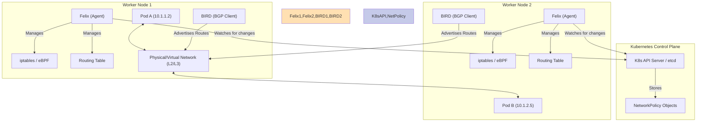

# Calico Architecture on Kubernetes

## 1. Overview

Project Calico is an open-source networking and network security solution for containers, virtual machines, and native host-based workloads. It is one of the most popular Container Network Interface (CNI) plugins for Kubernetes.

Calico is known for two main capabilities:

1.  **High-Performance Networking:** It provides a highly scalable, pure Layer 3 networking approach that can deliver bare-metal performance. Instead of using overlays (like VXLAN), it often configures the underlying network fabric to route packets directly to pods.
2.  **Rich Network Policy Enforcement:** Calico implements the full range of Kubernetes Network Policy features and also offers its own extended `CalicoPolicy` CRD for more advanced security rules.

## 2. Core Components

Calico's architecture is based on a set of distributed components that run on both the master and worker nodes of a Kubernetes cluster.

### a. Felix

`Felix` is the primary Calico agent that runs as a `DaemonSet` on every node in the cluster.

*   **Function:** Its main job is to program routes and Access Control Lists (ACLs) in the Linux kernel of the host machine.
*   **Process:**
    1.  Watches the Kubernetes API server for information about pods, endpoints, and network policies.
    2.  Translates network policies into rules that the kernel can understand (e.g., `iptables` rules or eBPF programs).
    3.  Programs the host's routing table to direct traffic to and from pods running on that node.

### b. CNI Plugin (`calico-cni`)

This is the plugin that integrates Calico with the Kubernetes kubelet.

*   **Function:** It handles the network plumbing for pods when they are created or destroyed.
*   **Process:** When a pod is scheduled on a node, the kubelet calls the `calico-cni` plugin, which allocates an IP address for the pod's network interface and wires it into the host's network stack.

### c. BIRD (BGP Client)

Calico uses the Border Gateway Protocol (BGP) to distribute routing information between nodes. BIRD is a popular open-source BGP client that runs alongside Felix on each node.

*   **Function:** Advertises the IP addresses of pods hosted on its node to all other nodes in the cluster.
*   **Result:** Every node learns how to route traffic directly to every pod, no matter which node it's on. This eliminates the need for a network overlay and avoids encapsulation overhead.

### d. Datastore

Calico needs a place to store its operational state and policies. In a Kubernetes environment, it uses the Kubernetes API server (`etcd`) as its datastore by default. This is efficient as it doesn't require a separate database.

## 3. How It Works

### Pod-to-Pod Networking

1.  When `Pod A` on `Node 1` wants to send a packet to `Pod B` on `Node 2`, the packet leaves `Pod A` and hits the root network namespace of `Node 1`.
2.  `Node 1`'s routing table, programmed by Felix via BIRD, knows that the IP for `Pod B` is reachable via `Node 2`.
3.  The packet is routed directly to `Node 2` over the underlying network. No encapsulation (like VXLAN or IP-in-IP) is needed in a pure BGP setup.
4.  When the packet arrives at `Node 2`, its routing table directs it to the correct interface for `Pod B`.

### Network Policy Enforcement

1.  When you create a `NetworkPolicy` object in Kubernetes, Felix sees it.
2.  Felix translates the policy's YAML definition (e.g., "allow traffic from pods with label `app: frontend`") into `iptables` rules or an eBPF program.
3.  These rules are applied to the network interfaces of the relevant pods, filtering traffic at the kernel level before it can even reach the pod's application. This is extremely fast and secure.