# 🐙 How GitHub Stores Data: A High-Level Architecture

This document provides a high-level overview of GitHub's storage architecture. It's not a single database but a complex, distributed system with different storage solutions for different types of data.

---

## Visualizing the Architecture

This diagram shows the main components of GitHub's application and storage layers.

```mermaid
flowchart TD
    %% --- Style Definitions ---
    classDef userStyle fill:#e0f7fa,stroke:#00796b
    classDef appStyle fill:#dcedc8,stroke:#558b2f
    classDef gitStyle fill:#fce4ec,stroke:#ad1457
    classDef dbStyle fill:#e3f2fd,stroke:#0d47a1
    classDef searchStyle fill:#fff3e0,stroke:#ef6c00
    classDef cacheStyle fill:#f3e5f5,stroke:#6a1b9a

    %% --- Components ---
    User["👨‍💻 User (via Web/CLI)"]

    subgraph AppLayer["GitHub Application Layer"]
        AppServer["Ruby on Rails Application"]
    end

    subgraph StorageLayer["Storage Backends"]
        subgraph GitStorage["Git Repository Storage (DGit)"]
            PrimaryRepo["Primary Git Replica"]
            Replica1["Replica 1"]
            Replica2["Replica 2"]
            PrimaryRepo <--> Replica1
            PrimaryRepo <--> Replica2
        end
        
        subgraph DBStorage["Database (MySQL)"]
            direction LR
            DBShard1["MySQL Shard 1"]
            DBShard2["MySQL Shard 2"]
            DBShardN["..."]
        end

        subgraph SearchStorage["Search (Elasticsearch)"]
            ESCluster["Elasticsearch Cluster"]
        end

        subgraph CacheStorage["Caching"]
            Redis["Redis"]
            Memcached["Memcached"]
        end
    end

    %% --- Connections ---
    User -- "HTTPS / SSH" --> AppServer
    AppServer -- "Git Operations (clone, push)" --> GitStorage
    AppServer -- "Metadata (Issues, PRs, Users)" --> DBStorage
    AppServer -- "Code Search" --> SearchStorage
    AppServer -- "Session/Job Caching" --> CacheStorage

    %% --- Apply Styles ---
    class User userStyle;
    class AppServer appStyle;
    class GitStorage,PrimaryRepo,Replica1,Replica2 gitStyle;
    class DBStorage,DBShard1,DBShard2,DBShardN dbStyle;
    class SearchStorage,ESCluster searchStyle;
    class CacheStorage,Redis,Memcached cacheStyle;
```

### How to Explain This Diagram:

1.  **Git Repository Storage (DGit)**:
    *   This is the heart of GitHub. All the `git` data (commits, branches, tags, etc.) is stored here.
    *   GitHub developed a system called **DGit** (Distributed Git). For every repository, there are at least **three replicas** stored on different servers.
    *   When you `git push`, the data is written to a primary replica and then synchronously copied to the other replicas. If the primary server fails, one of the replicas is automatically promoted to be the new primary, ensuring your repository is always available.

2.  **Database (MySQL)**:
    *   All the data that is **not** Git data lives in massive, horizontally-sharded MySQL clusters. This includes:
        *   User accounts and permissions
        *   Pull Requests and Issues
        *   Comments, reviews, and reactions
    *   "Sharding" means they split the database into many smaller, faster databases to handle the immense load.

3.  **Search (Elasticsearch)**:
    *   To provide fast code search across trillions of lines of code, GitHub uses a huge **Elasticsearch** cluster.
    *   Git data is indexed and fed into Elasticsearch, allowing for complex and rapid text-based searches that would be too slow to perform on raw Git data directly.

4.  **Caching (Redis & Memcached)**:
    *   To speed up the website and reduce load on the main databases, GitHub uses caching layers extensively.
    *   **Redis** and **Memcached** are used to temporarily store frequently accessed data, like user sessions, dashboard activity, and rendered markdown, so it can be retrieved from memory instead of from a database.