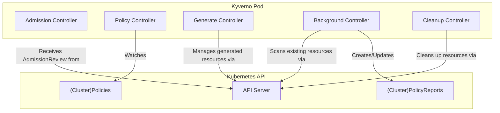

# Kyverno Architecture on Kubernetes

## 1. Overview

Kyverno is a policy engine designed specifically for Kubernetes. It operates as a dynamic admission controller and manages policies as Kubernetes resources, meaning you don't need to learn a new language (like Rego) to write policies.

The core of Kyverno's architecture is its use of Kubernetes **Dynamic Admission Control** to intercept API requests and enforce policies.

## 2. Core Components

Kyverno is deployed as a single Pod in the `kyverno` namespace, which contains several controllers working together.



### a. Admission Controller (Webhook Server)

This is the heart of Kyverno. It's a web server that registers itself with the Kubernetes API server via `MutatingAdmissionWebhookConfiguration` and `ValidatingAdmissionWebhookConfiguration` resources.

*   **Function:** Intercepts incoming API requests for creating, updating, and deleting resources.
*   **Process:**
    1.  A client (like `kubectl` or a GitOps controller) sends a request to the Kubernetes API server.
    2.  The API server forwards an `AdmissionReview` object to the Kyverno webhook.
    3.  Kyverno evaluates the request against relevant policies.
    4.  It sends back a response:
        *   **Allowed:** The request is valid.
        *   **Denied:** The request violates a policy.
        *   **Patched (for mutation):** The request is modified to conform to a policy.

### b. Policy and Rule Controllers

These controllers watch for changes to Kyverno's own Custom Resource Definitions (CRDs).

*   **`ClusterPolicy` and `Policy`:** These are the CRDs where you define your rules. The controllers parse these resources, validate their syntax, and load them into memory for the webhook to use.
*   **`PolicyReport` and `ClusterPolicyReport`:** These CRDs are used for reporting the results of policy evaluations, especially for background scans.

### c. Background Controller

This controller is responsible for applying policies to existing resources that were in the cluster *before* the policy was created.

*   **Function:** Scans existing resources periodically.
*   **Use Case:** For `validate` rules that need to check for compliance across the entire cluster, not just on new or updated resources. It generates `PolicyReport` resources to show compliance status.

### d. Generate Controller

This controller manages `generate` rules, which are used to create new resources based on a trigger.

*   **Function:** Watches for the creation or update of a "trigger" resource.
*   **Process:** When a trigger resource is detected, the Generate Controller creates a new Kubernetes resource according to the rule's definition (e.g., creating a default `NetworkPolicy` for every new `Namespace`). It also manages the lifecycle of these generated resources.

### e. Cleanup Controller

This controller works with the Generate Controller to manage the lifecycle of generated resources.

*   **Function:** When a resource that triggered a `generate` rule is deleted, the Cleanup Controller ensures that the resources it generated are also deleted. This prevents orphaned resources.

## 3. Request Flow Deep Dive

Here’s a step-by-step look at how an API request is processed.

### a. Mutation Flow

1.  `kubectl apply -f my-pod.yaml` is executed.
2.  The request hits the K8s API Server.
3.  The API Server's **Mutating Admission Webhook** phase is triggered. It sends the request to the Kyverno webhook.
4.  Kyverno finds all `ClusterPolicies` or `Policies` with `mutate` rules that match the incoming resource (e.g., a Pod in the `default` namespace).
5.  Kyverno generates a JSONPatch with the required changes (e.g., adding a label `owner: dev-team`).
6.  Kyverno sends the patch back to the API Server in its `AdmissionReview` response.
7.  The API Server applies the patch to the original Pod object. The object is now modified.

### b. Validation Flow

1.  After the mutation phase, the (potentially modified) object enters the **Validating Admission Webhook** phase.
2.  The API Server sends the object to the Kyverno webhook again.
3.  Kyverno finds all policies with `validate` rules that match the resource.
4.  It evaluates the rules:
    *   **`enforce` mode (default):** If any rule fails, Kyverno sends a "denied" response with an error message. The API Server rejects the request and sends the error to the client.
    *   **`audit` mode:** If a rule fails, Kyverno allows the request but records the failure in a `PolicyReport` and logs an event.
5.  If all `enforce` rules pass, Kyverno sends an "allowed" response.
6.  The API Server persists the object to `etcd`.

## 4. High Availability and Scalability

*   **High Availability:** Kyverno is typically deployed with multiple replicas (e.g., 3). A Kubernetes `Service` load-balances the admission review requests across the Kyverno pods. This ensures that if one pod fails, others can handle the traffic.
*   **Scalability:** The performance of Kyverno depends on the number and complexity of the policies. Since the policies are loaded into memory, resource requests/limits (CPU/Memory) for the Kyverno deployment should be adjusted based on the cluster's needs. The webhook timeout is a critical setting to prevent the API server from becoming unresponsive.

## 5. Summary Diagram: Request Lifecycle

```mermaid
graph TD
    subgraph "Kubernetes Control Plane"
        APIServer["K8s API Server"]
        ETCD["etcd"]
    end

    subgraph "Kyverno Pod"
        Webhook["Webhook Server"]
        Policies["In-Memory Policies"]
    end

    Client["kubectl / API Client"] --> APIServer
    APIServer -- "1. MutatingAdmissionReview" --> Webhook
    Webhook -- "Reads" --> Policies
    Webhook -- "2. JSONPatch Response" --> APIServer
    APIServer -- "3. Applies Patch" --> APIServer
    APIServer -- "4. ValidatingAdmissionReview" --> Webhook
    Webhook -- "5. Validation Decision" --> APIServer
    
    alt Validation Success
        APIServer -- "6a. Persist Object" --> ETCD
        APIServer -- "7a. OK 200" --> Client
    else Validation Failure
        APIServer -- "6b. Deny Request" --> Client
    end

    style Webhook fill:#cde4ff
    style Policies fill:#cde4ff
```