#  Kubelet & Containerd Critical Failure Recovery

This guide documents the steps to resolve a critical Kubelet service failure on a Kubernetes node, which can lead to an unreachable API Server if it occurs on a control plane node.

---

## 🛑 Symptom: Kubelet Fails to Start

The Kubelet service is stuck in an auto-restart loop and cannot connect to the Container Runtime Interface (CRI). The logs show the following error:

```log
E1117 05:22:58.901957 2714 run.go:74] "command failed" err="failed to run Kubelet: validate service connection: validate CRI v1 runtime API for >"
```

## Diagram: Kubelet, CRI, and Containerd Interaction

This diagram shows how the components are supposed to connect. The failure occurred because the link between Kubelet and Containerd via the CRI socket was broken.

```mermaid
flowchart TD
    subgraph "Control Plane Node"
        Kubelet["🧩 Kubelet"]
        Containerd["📦 Containerd Runtime"]
        CRISocket["🔌 CRI Socket<br>(/run/containerd/containerd.sock)"]
    end

    Kubelet -- "Needs to connect via" --> CRISocket
    Containerd -- "Must create and listen on" --> CRISocket

    style Kubelet fill:#d4edda,stroke:#2e7d32
    style Containerd fill:#cde4ff,stroke:#1565c0
    style CRISocket fill:#f8d7da,stroke:#721c24
```



## 🔧 Resolution Steps

The issue is resolved in two parts: first by enabling the CRI plugin in Containerd, and second by telling the Kubelet where to find the correct CRI socket.

### 1. Enable the CRI Plugin in Containerd

**Problem**: The `containerd` runtime, although running, has its CRI plugin explicitly disabled. This prevents it from creating the socket file (`/run/containerd/containerd.sock`) that Kubelet needs to communicate with it.

**Action**:
1.  Edit the Containerd configuration file:
    ```bash
    sudo vi /etc/containerd/config.toml
    ```
2.  Find the `disabled_plugins` line and remove `"cri"` from the list. If it's the only one, make the list empty.
    ```toml
    # BEFORE:
    # disabled_plugins = ["cri"]
    
    # AFTER:
    disabled_plugins = []
    ```
3.  Restart the Containerd service to apply the change:
    ```bash
    sudo systemctl restart containerd
    ```

### 2. Set the Correct Kubelet Runtime Endpoint

**Problem**: After fixing Containerd, the Kubelet may still fail if it's configured to look for the wrong socket (like the old `dockershim.sock`) or has no endpoint defined.

**Action**:
1.  Edit the Kubelet configuration file:
    ```bash
    sudo vi /var/lib/kubelet/config.yaml
    ```
2.  Set the `containerRuntimeEndpoint` to point to the standard containerd socket:
    ```yaml
    # Ensure this line is set correctly:
    containerRuntimeEndpoint: unix:///run/containerd/containerd.sock
    ```
3.  Reload the system daemon and restart Kubelet:
    ```bash
    sudo systemctl daemon-reload
    sudo systemctl restart kubelet
    ```

## ✅ Verification

Once the configurations are aligned, the Kubelet will start successfully and launch the necessary system Pods.

1.  **Verify Kubelet is running**:
    ```bash
    sudo systemctl status kubelet
    ```
2.  **Verify runtime connection**:
    ```bash
    sudo crictl --runtime-endpoint unix:///run/containerd/containerd.sock ps
    ```
    *(This should list all control plane and system containers as `Running`)*.

3.  **Verify Cluster Node Status**:
    ```bash
    kubectl get nodes
    ```
    *(The node should now show a `Ready` status)*.